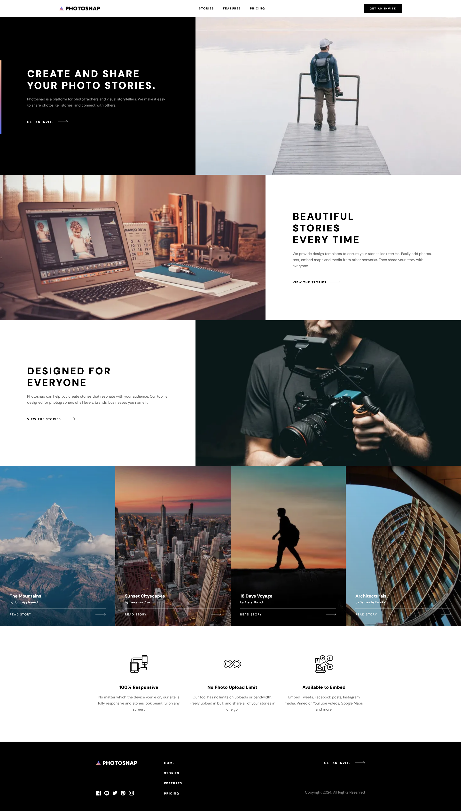

# Frontend Mentor - Photosnap Website solution

This is a solution to the [Photosnap Website challenge on Frontend Mentor](https://www.frontendmentor.io/challenges/photosnap-multipage-website-nMDSrNmNW). Frontend Mentor challenges help you improve your coding skills by building realistic projects. 

## Table of contents

- [Overview](#overview)
  - [The challenge](#the-challenge)
  - [Screenshot](#screenshot)
  - [Links](#links)
- [My process](#my-process)
  - [Built with](#built-with)
  - [What I learned](#what-i-learned)
  - [Continued development](#continued-development)
- [Author](#author)
- [Acknowledgments](#acknowledgments)

**Note: Delete this note and update the table of contents based on what sections you keep.**

## Overview

### The challenge

Users should be able to:

- View the optimal layout for each page depending on their device's screen size
- See hover states for all interactive elements throughout the site

### Screenshot



### Links

- Solution URL: [https://www.frontendmentor.io/challenges/photosnap-multipage-website-nMDSrNmNW/hub](https://www.frontendmentor.io/challenges/photosnap-multipage-website-nMDSrNmNW/hub)
- Live Site URL: [https://photosnap-sigma.vercel.app/](https://photosnap-sigma.vercel.app/)

## My process

### Built with

- Semantic HTML5 markup
- CSS custom properties
- Flexbox
- CSS Grid
- Mobile-first workflow
- [React](https://reactjs.org/) - JS library
- [Next.js](https://nextjs.org/) - React framework
- [Framer motion](https://www.framer.com/motion/introduction/) - For animation

### What I learned

I learned the basic of how to use framer motion using motion.div

```jsx
<motion.div
            whileHover={{
                y: -24,
                transition: { duration: 0.25 }
            }}
            className={`${classes.card} `}>
            <Image src={image} alt={alt} className={classes.cardImg} />
            <div className={classes.text}>
                <div className={classes.info}>
                    {date && <p className={classes.date}>{date}</p>}
                    <h3>{title}</h3>
                    <p className={classes.author}>by {author}</p>
                </div>
                <div className={classes.separator} />
                <Link className={classes.CTA} href=''>
                    <p className={classes.textCTA}>{CTA}</p>
                    <p className={classes.arrowCTA}></p>
                </Link>
            </div>
        </motion.div>
```


### Continued development

I want to learn more about :
- shopify API, to be able to setup a headless e-commerce website
- framer motion and set up scrolling animation, so that the content of the page appears bit by bit.

## Author

- Website - [André-Lubin Thomas](https://www.thomasandrelubin.fr/)
- Frontend Mentor - [@Lordyner](https://www.frontendmentor.io/profile/Lordyner)

## Acknowledgments

Thanks to the discord and the moderators for answering my questions and giving me advice. 
